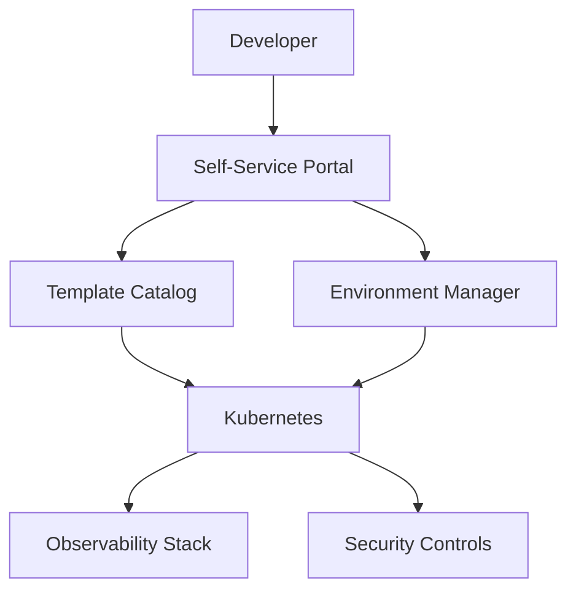

The DevOps landscape is undergoing a quiet revolution. While AI agents capture headlines, fundamental shifts in how we manage infrastructure, security, and deployment pipelines are delivering compounding efficiency gains. Today's deep dive explores the tools and practices defining modern operations.

## Security-as-Code: From Scans to Policies

Traditional security scanning is reactive—find vulnerabilities after code is written. **Security-as-Code (SaC)** flips this paradigm by embedding security policies directly into the development workflow.

### The Policy-as-Code Revolution

Tools like **OPA (Open Policy Agent)** and **Kyverno** have matured into essential infrastructure:

```yaml
# Example: Kyverno policy enforcing secure container images
apiVersion: kyverno.io/v1
kind: ClusterPolicy
metadata:
  name: require-signed-images
spec:
  validationFailureAction: enforce
  rules:
  - name: verify-signature
    match:
      resources:
        kinds:
        - Pod
    validate:
      imageExtractors:
        Pod:
        - name: containers
          jsonPath: .spec.containers[*].image
      message: "Images must be signed and verified"
      pattern:
        spec:
          containers:
          - image: "!*"
```

### Automated Security Gates

Modern CI/CD pipelines now implement multi-stage security gates:

1. **Pre-commit**: Secret scanning (trufflehog, gitleaks)
2. **Build**: SBOM generation, SAST scanning
3. **Registry**: Image signing, vulnerability scanning
4. **Deploy**: Policy validation, runtime configuration checks
5. **Runtime**: Anomaly detection, drift monitoring

**Key insight:** Security teams are becoming platform teams, building guardrails instead of gatekeeping.

## Infrastructure as TypeScript

The "YAML fatigue" is real. Infrastructure as Code (IaC) is evolving toward general-purpose programming languages, and **TypeScript is winning**.

### Pulumi and CDKTF Adoption Surge

```typescript
// Infrastructure as TypeScript with Pulumi
import * as aws from '@pulumi/aws';
import * as docker from '@pulumi/docker';

const repo = new aws.ecr.Repository('app-repo', {
  imageScanningConfiguration: { scanOnPush: true },
});

const image = new docker.Image('app-image', {
  imageName: repo.repositoryUrl,
  build: {
    context: './app',
    dockerfile: './Dockerfile',
  },
});

const cluster = new aws.ecs.Cluster('app-cluster');

// Type-safe service definition
const service = new aws.ecs.Service('app-service', {
  cluster: cluster.arn,
  desiredCount: 3,
  taskDefinitionArgs: {
    containerDefinitions: [{
      name: 'app',
      image: image.imageName,
      memory: 512,
      essential: true,
      portMappings: [{ containerPort: 8080 }],
    }],
  },
});

// Export type-safe outputs
export const serviceUrl = pulumi.interpolate`https://${service.name}.example.com`;
```

### Benefits of TypeScript IaC

| Feature | YAML/Terraform | TypeScript |
|---------|---------------|------------|
| Type safety | Limited | Full IDE support |
| Testing | External tools | Built-in unit tests |
| Refactoring | Manual | IDE-powered |
| Abstractions | Modules | Functions, classes |
| Debugging | Log parsing | Breakpoints, REPL |

### The Monorepo Advantage

With tools like **Turborepo** and **Nx**, teams can now:

- Share infrastructure code across projects
- Type-check infrastructure changes against application code
- Run integration tests that span infra and app layers
- Enforce consistency through shared libraries

## Kubernetes: The Platform Platform

Kubernetes has evolved from container orchestrator to **platform foundation**. The trend is clear: build internal platforms on Kubernetes, not around it.

### Operator Pattern Goes Mainstream

Custom Resource Definitions (CRDs) and Controllers are now standard for:

- **Database provisioning**: CrunchyData Postgres, MongoDB Atlas Operator
- **Secret management**: External Secrets Operator, Sealed Secrets
- **GitOps deployment**: Flux, ArgoCD
- **ML workflows**: Kubeflow, MLflow operators

### Platform Engineering Emerges

The **Internal Developer Platform (IDP)** pattern consolidates:



Tools like **Backstage**, **Humanitec**, and **Mia-Platform** provide the interface layer, while Kubernetes handles the underlying complexity.

## CI/CD Pipelines Get Smarter

The era of "dumb" pipelines is ending. Modern CI/CD incorporates:

### Intelligent Test Selection

- **Impact Analysis**: Run only tests affected by changed code
- **Flaky Test Detection**: Automatically quarantine unreliable tests
- **Parallelization Optimization**: Dynamically allocate test jobs based on historical duration

### Progressive Delivery

```yaml
# Argo Rollouts progressive delivery
apiVersion: argoproj.io/v1alpha1
kind: Rollout
metadata:
  name: app-rollout
spec:
  replicas: 10
  strategy:
    canary:
      steps:
      - setWeight: 10
      - pause: {duration: 5m}
      - setWeight: 30
      - analysis:
          templates:
          - templateName: success-rate
          startingStep: 2
          args:
          - name: service-name
            value: app-service
      - setWeight: 50
      - pause: {duration: 5m}
      - setWeight: 100
```

### GitOps Maturity

- **Multi-cluster management**: Flux/ArgoCD managing hundreds of clusters
- **Secret management**: GitOps-friendly secret solutions (SOPS, Vault integration)
- **Drift detection**: Automated alerts when cluster state diverges from Git

## Observability: The Three Pillars Converge

Metrics, logs, and traces are merging into unified observability platforms.

### OpenTelemetry Becomes Ubiquitous

OTel is now the standard for:

- **Instrumentation**: Auto-instrumentation for 50+ languages/frameworks
- **Collection**: OTLP protocol for efficient data transmission
- **Processing**: Collector with transforms, filtering, and routing
- **Export**: Unified format for all backends

### The Observability Stack

```
┌─────────────────────────────────────────────────┐
│                  Application                     │
│  ┌─────────────────────────────────────────┐   │
│  │        OpenTelemetry SDK                 │   │
│  └─────────────────────────────────────────┘   │
└──────────────────────┬──────────────────────────┘
                       │ OTLP
                       ▼
┌─────────────────────────────────────────────────┐
│            OTel Collector                       │
│  ┌─────────┐ ┌─────────┐ ┌─────────┐          │
│  │Receiver │ │Processor│ │Exporter │          │
│  └─────────┘ └─────────┘ └─────────┘          │
└──────────────────────┬──────────────────────────┘
                       │
        ┌──────────────┼──────────────┐
        ▼              ▼              ▼
   ┌─────────┐   ┌─────────┐   ┌─────────┐
   │ Metrics │   │  Logs   │   │ Traces  │
   │Backend  │   │ Backend │   │ Backend │
   └─────────┘   └─────────┘   └─────────┘
```

### Cost-Effective Observability

High-cardinality observability is expensive. New approaches:

- **Adaptive Sampling**: Adjust sample rates based on traffic patterns
- **Tail-Based Sampling**: Sample interesting traces (errors, slow requests)
- **Aggregation**: Pre-aggregate metrics before storage
- **Tiered Storage**: Hot/warm/cold data tiers

## TypeScript Ecosystem Updates

### Runtime Innovations

**Bun 2.0** continues to challenge Node.js:

- Native TypeScript execution (no compilation step)
- Built-in test runner with Jest compatibility
- Integrated package manager (2x faster than pnpm)
- Native SQLite support for embedded databases
- WebSocket server built into the runtime

**Deno 2.0** focuses on:

- Full npm compatibility (import npm packages directly)
- Built-in edge functions for Deno Deploy
- TypeScript-first configuration (deno.json)
- Sandboxed by default with permission flags

### Framework Evolution

**Next.js 15** continues to push React forward:

- **Partial Prerendering**: Static shell with dynamic islands
- **Server Components**: Default for new components
- **Server Actions**: Type-safe form mutations
- **Parallel Routes**: Simultaneous data fetching

**NestJS 11** for enterprise backends:

- Native Bun runtime support
- GraphQL v4 with subscriptions
- Microservice decorators
- Built-in OpenAPI generation

### Type-Safe Everything

The industry is converging on end-to-end type safety:

```typescript
// tRPC: End-to-end type safety
const router = t.router({
  getUser: t.procedure.input(z.string()).query(async (opts) => {
    return db.users.find(opts.input);
  }),
  updateUser: t.procedure
    .input(z.object({ id: z.string(), name: z.string() }))
    .mutation(async (opts) => {
      return db.users.update(opts.input);
    }),
});

// Client usage - fully typed!
const user = await client.getUser.query('user-123');
const updated = await client.updateUser.mutate({
  id: 'user-123',
  name: 'New Name',
});
```

## Data Engineering Convergence

Data engineering is becoming essential for all developers, not just specialists.

### Streaming Goes Mainstream

Apache Kafka alternatives are democratizing streaming:

- **Redpanda**: Kafka-compatible, no JVM, simpler operations
- **Apache Pulsar**: Multi-tenancy, geo-replication
- **NATS JetStream**: Lightweight, cloud-native

### The Modern Data Stack

```
Sources → Fivetran/Airbyte → Warehouse → dbt → BI + Reverse ETL
         (Ingestion)        (Storage)  (Transform)  (Output)
```

### Feature Stores for ML

Real-time ML requires real-time features:

- **Feast**: Open-source feature store
- **Tecton**: Managed feature platform
- **Hopsworks**: Full ML platform with feature store

## What to Watch

| Trend | Impact | Action |
|-------|--------|--------|
| TypeScript IaC | High | Evaluate Pulumi/CDKTF for new projects |
| Security-as-Code | High | Implement policy-as-code in CI/CD |
| Platform Engineering | Medium | Build internal developer platform |
| OpenTelemetry | High | Standardize on OTel for observability |
| Bun runtime | Medium | Benchmark Bun for new services |

## Bottom Line

The DevOps and security landscape is maturing rapidly. The winners are:

1. **TypeScript**: Universal language from frontend to infrastructure
2. **Policy-as-Code**: Security built into development workflows
3. **Platform Engineering**: Kubernetes as the foundation for internal platforms
4. **Unified Observability**: OpenTelemetry as the standard
5. **Progressive Delivery**: Smarter, safer deployment strategies

The future belongs to teams that treat operations as a product—building self-service platforms that enable developers to move fast safely.

---

**Links:**
- [Pulumi Documentation](https://www.pulumi.com/docs/)
- [Kyverno Policies](https://kyverno.io/policies/)
- [OpenTelemetry](https://opentelemetry.io/)
- [Bun Runtime](https://bun.sh/)
- [Next.js 15](https://nextjs.org/blog)
- [NestJS 11](https://docs.nestjs.com/)
- [Argo Rollouts](https://argoproj.github.io/argo-rollouts/)
- [Flux GitOps](https://fluxcd.io/)

---

**Tags:** #DevOps #Security #TypeScript #Infrastructure #Kubernetes #Observability #CI/CD #PlatformEngineering #2026
